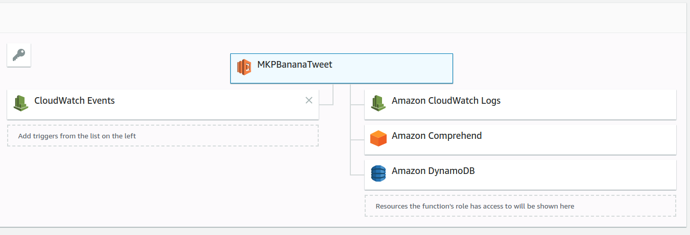
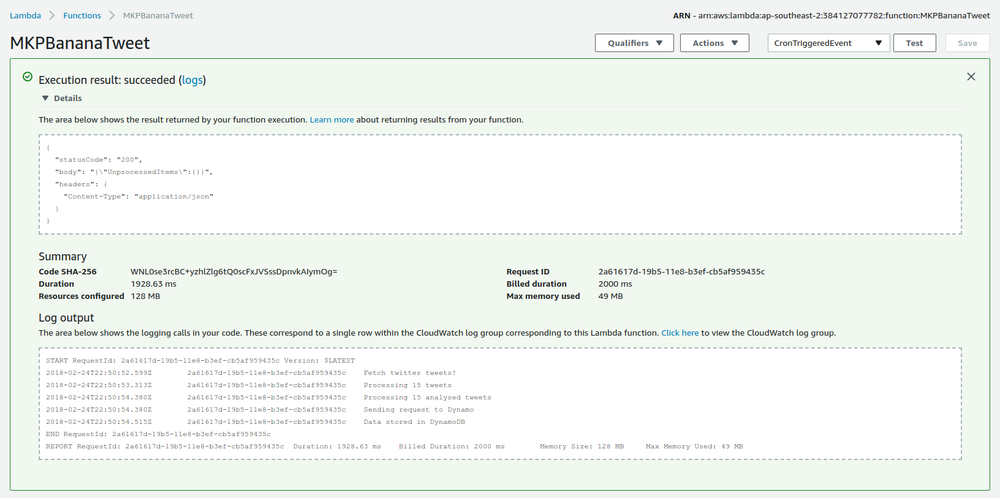

# MonkeyPatch Banana Tweets

This project is an example of AWS Lambda Function polling tweets from the Twitter API, running sentiment detection with AWS Comprehend and storing results in a DynamoDB table.


This example uses the [AWS NodeJS SDK](https://aws.amazon.com/sdk-for-node-js) and assumes you are familiar with [npm](https://www.npmjs.com)
It is recommended to use node `v6.10` for this project.

## Lambda Setup

### AWS Configuration
AWS configuration can be set using the CLI command `aws configure`
Alternatively, the configuration can be set in the file `~/.aws/credentials`
To programmatically configure the services, AWS API Admin access will be required.

### AWS Services Setup
The script `setup.js` will create the required IAM Role, Lambda Function and DynamoDB Table for you. It is assumed that the AWS credentials previously configured have admin access.
To configure the Lambda Function and associated services, run the following scripts:
```
# Package the lambda code
./create_zip.sh

# Configure the AWS services
node setup.js
```
After creating the AWS Services, you can log into your AWS Console and verify the Lambda Function has been created.

### Twitter API configuration
You will need to configure your Twitter API credentials. You need to create a [Twitter Application](https://apps.twitter.com/)
In your Lambda Function environment variables, you need to configure your Twitter credentials
```
TWITTER_CONSUMER_KEY=
TWITTER_CONSUMER_SECRET=
TWITTER_ACCESS_TOKEN=
TWITTER_ACCESS_TOKEN_SECRET=
```

### AWS Regions configuration
You can also define the AWS regions to use for DynamoDB and Comprehend (AWS Comprehend is not available in all regions)
```
AWS_REGION_COMPREHEND=us-east-1
AWS_REGION_DYNAMODB=ap-southeast-2
```

## Execute your Lambda Function
The CloudWatch event scheduler is disabled by default. You will need to enable it if you want to automatically import data every 20 minutes.

You can also create a test trigger from the AWS Lambda function > Configure Test Event and then select the template Scheduled Event.
Save and then click on the Test button to run trigger your Lambda function.

You should see the Twitter data being processed and save into DynamoDB


Browsing to the DynamoDB > MKPTweets tables you will find the records and their associated sentiment analysis


## Redeploy the Lambda Function
When modified, the lambda function code can be zipped up and uploaded to AWS Lambda with the deploy script.

You need to install the AWS CLI first
```
pip install awscli colorama --upgrade --user
```

Then call the deployment script
```
./deploy.sh
```

## Lambda Function Local testing
You can test lambda functions locally by using the library [lambda-local](https://www.npmjs.com/package/lambda-local)
```
npm install -g lambda-local
```

And then execute your function by simulating an event
```
lambda-local -l lib/index.js -h handler -e ./__tests__/events/schedule_event.json -t 15
```

## Unit Testing
The unit test suite is located under the `__tests__` folder and executed using [Jest](https://facebook.github.io/jest/)
This basic test suite can be run using the command
```
npm run test
```

## About MonkeyPatch
We are a team of It experts. We are specialised in cloud, mobile and database.
[MonkeyPatch](http://www.monkeypatch.io/en)

